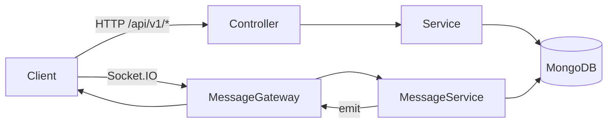

# chat-app-backend

A NestJS 11 backend for a social/chat-style app that exposes versioned REST APIs and Socket.IO realtime messaging.  
It handles authentication, users, posts/reactions, conversations/messages, and Cloudinary-based media uploads on top of MongoDB.

## Features

- API versioning with URI format (`/api/v1/...`) and global request validation via `ValidationPipe`.
- JWT authentication (`/auth/sign-up`, `/auth/sign-in`) with password hashing via `bcrypt`.
- Auth-protected user APIs (`/users`) including profile fetch, user listing/search, updates, soft-delete, and avatar metadata updates.
- Post APIs (`/posts`) for create/read/update/delete, media metadata attach/remove, and reaction add/remove.
- Conversation APIs (`/conversations`) for private chat creation, group creation, member management, listing, and soft-delete.
- Message APIs (`/messages`) for sending, listing (paginated), updating, deleting (soft delete), and marking seen.
- Realtime messaging through Socket.IO gateway with room-based emits (`new_message`, `update_message`, `remove_message`, `seen_message`).
- Cloudinary upload endpoints (`/image/upload`, `/image/upload-multiple`) using Multer + stream upload.
- MongoDB persistence with Mongoose schemas for users, posts, reactions, conversations, and messages.
- DTO-based validation/transformation using `class-validator` and `class-transformer`.
- `notification` and part of `auth`/`reaction` include scaffolded placeholder endpoints that currently return static strings.

## Tech Stack

- NestJS 11 + TypeScript
- MongoDB + Mongoose (`@nestjs/mongoose`, `mongoose`)
- Socket.IO WebSockets (`@nestjs/websockets`, `@nestjs/platform-socket.io`)
- JWT auth (`@nestjs/jwt`) + `bcrypt`
- Cloudinary media integration (`cloudinary`, `streamifier`, Multer interceptors)
- Validation/serialization (`class-validator`, `class-transformer`)
- Tooling and tests: Jest, Supertest, ESLint, Prettier

## Architecture

- Modules:
  - `AuthModule`: sign-up/sign-in, JWT token issuance, password hashing.
  - `UserModule`: profile and user management.
  - `PostModule` + `ReactionModule`: post lifecycle and reactions.
  - `ConversationModule`: private/group conversation management.
  - `MessageModule`: message CRUD + seen state + websocket fan-out.
  - `CloudinaryModule`: file upload/delete integration.
  - `ResourceModule`: shared ownership checks for role-based guard logic.
  - `NotificationModule`: scaffolded CRUD controller/service.
- REST flow: Controller -> Service -> Mongoose Model -> MongoDB.
- Realtime flow: `MessageGateway` subscribes to socket events and emits room-targeted updates after service-level DB changes.
- Response shaping: custom `TransformDTO` interceptor wraps most responses as `{ message: "Success", data: ... }`, with pagination metadata when applicable.



## Project Structure

```text
.
+- src/
�  +- _cores/                  # guards, decorators, interceptor, shared globals
�  +- auth/
�  +- user/
�  +- post/
�  +- reaction/
�  +- conversation/
�  +- message/
�  +- cloudinary/
�  +- resource/
�  +- notification/
�  +- app.module.ts
�  +- main.ts
+- package.json
+- package-lock.json
+- README.md
```

## Getting Started

### Prerequisites

- Node.js (npm is used in this repo via `package-lock.json`; Node 18+ recommended)
- MongoDB (local instance or MongoDB Atlas)
- Optional: Cloudinary account for media upload endpoints

### Installation

```bash
npm install
```

Create a `.env` file (no `.env.example` is currently present), then run:

```bash
npm run start:dev
```

### Environment Variables

No `.env.example` is present in the repository. Based on config usage, this is an example template:

| Variable                | Required        | Description                                                         |
| ----------------------- | --------------- | ------------------------------------------------------------------- |
| `PORT`                  | No              | HTTP port (defaults to `3000` if unset).                            |
| `MONGODB_URL`           | Yes             | MongoDB connection string used by `MongooseModule.forRootAsync`.    |
| `JWT_SECRET`            | Yes             | Secret used to sign and verify JWT access tokens.                   |
| `JWT_EXPIRATION`        | Yes             | JWT expiry value passed to `signOptions.expiresIn` (example: `7d`). |
| `CLOUDINARY_NAME`       | Yes (for media) | Cloudinary cloud name.                                              |
| `CLOUDINARY_API_KEY`    | Yes (for media) | Cloudinary API key.                                                 |
| `CLOUDINARY_API_SECRET` | Yes (for media) | Cloudinary API secret.                                              |

Example `.env`:

```env
PORT=3000
MONGODB_URL=mongodb://localhost:27017/chat-app
JWT_SECRET=replace-with-a-strong-secret
JWT_EXPIRATION=7d
CLOUDINARY_NAME=your_cloud_name
CLOUDINARY_API_KEY=your_api_key
CLOUDINARY_API_SECRET=your_api_secret
```

Do not commit real credentials; keep secrets in environment variables or a secret manager.

### Running the App

```bash
# development (watch)
npm run start:dev

# build + production
npm run build
npm run start:prod

# lint + format
npm run lint
npm run format

# tests
npm run test
npm run test:e2e
```

## API

Swagger is not configured in `src/main.ts`.

- Base API versioned prefix: `/api/v1`
- Root route: `GET /api/v1` -> `"Hello World!"`
- Auth for protected routes uses `Authorization: Bearer <token>` with a custom JWT guard.

Key REST routes (from controllers):

- `POST /api/v1/auth/sign-up`
- `POST /api/v1/auth/sign-in`

- `GET /api/v1/users/profile`
- `POST /api/v1/users/upload-avatar`
- `GET /api/v1/users`
- `GET /api/v1/users/:id`
- `PATCH /api/v1/users/:id`
- `DELETE /api/v1/users/:id`

- `POST /api/v1/posts`
- `POST /api/v1/posts/:id/upload`
- `DELETE /api/v1/posts/:id/delete`
- `DELETE /api/v1/posts/:id/delete-multiple`
- `POST /api/v1/posts/reaction`
- `DELETE /api/v1/posts/reaction`
- `GET /api/v1/posts`
- `GET /api/v1/posts/:id`
- `PATCH /api/v1/posts/:id`
- `DELETE /api/v1/posts/:id`

- `POST /api/v1/conversations/private`
- `POST /api/v1/conversations/group`
- `GET /api/v1/conversations`
- `GET /api/v1/conversations/:id`
- `PATCH /api/v1/conversations/group/:id`
- `PATCH /api/v1/conversations/group/:id/members`
- `DELETE /api/v1/conversations/group/:id/members`
- `DELETE /api/v1/conversations/:id`

- `POST /api/v1/messages/conversation/:conversationId`
- `GET /api/v1/messages/conversation/:conversationId`
- `GET /api/v1/messages/:id`
- `PATCH /api/v1/messages/:id`
- `DELETE /api/v1/messages/:id`
- `PATCH /api/v1/messages/:id/seen`

- `POST /api/v1/image/upload`
- `POST /api/v1/image/upload-multiple`

- `GET /api/v1/reaction` (scaffold response)
- `POST /api/v1/notification`, `GET /api/v1/notification`, `GET /api/v1/notification/:id`, `PATCH /api/v1/notification/:id`, `DELETE /api/v1/notification/:id` (currently scaffold responses)

## Realtime (Socket.IO)

- Gateway: `MessageGateway` with `@WebSocketGateway({ cors: { origin: '*' } })`
- Namespace/path: defaults are used (root namespace, default Socket.IO path)
- Connection: standard Socket.IO client to your backend host/port

Client -> server events:

- `message`: payload is `conversationId: string`; server joins the socket to that room.
- `join_conversation`: payload is `string`; currently echoed back.

Server -> client events:

- `new_message`: payload is transformed message DTO (`_id`, `conversation`, `senderId`, `senderName`, `senderAvatarUrl`, `text`, `mediaFiles`, flags, timestamps, seen info).
- `update_message`: same payload shape as `new_message`.
- `remove_message`: payload is `messageId: string`.
- `seen_message`: payload is `{ messageId, seenBy: { seenById, seenByName, seenByAvatarUrl } }`.

Socket auth is not implemented in the gateway (no handshake token validation present).

## Testing

- Available scripts:
  - `npm run test`
  - `npm run test:watch`
  - `npm run test:cov`
  - `npm run test:e2e`
- Current repository state appears to have no project test files under `src/` or `test/`.
- `test:e2e` points to `test/jest-e2e.json`, but that file is not present in this repo snapshot.

## Deployment Notes

No Dockerfiles, docker-compose files, or CI workflow files were found in this repository snapshot.

Generic production checklist:

- Set `NODE_ENV=production`
- Configure `MONGODB_URL`, `JWT_*`, and Cloudinary env vars securely
- Build and run:
  - `npm run build`
  - `npm run start:prod`
- Restrict CORS origins for your deployed frontend domains (current HTTP CORS allowlist in `main.ts` is localhost-focused)

## License

This project is marked as `UNLICENSED` in `package.json`.  
If you plan to open-source it, add an explicit `LICENSE` file with your intended terms.
